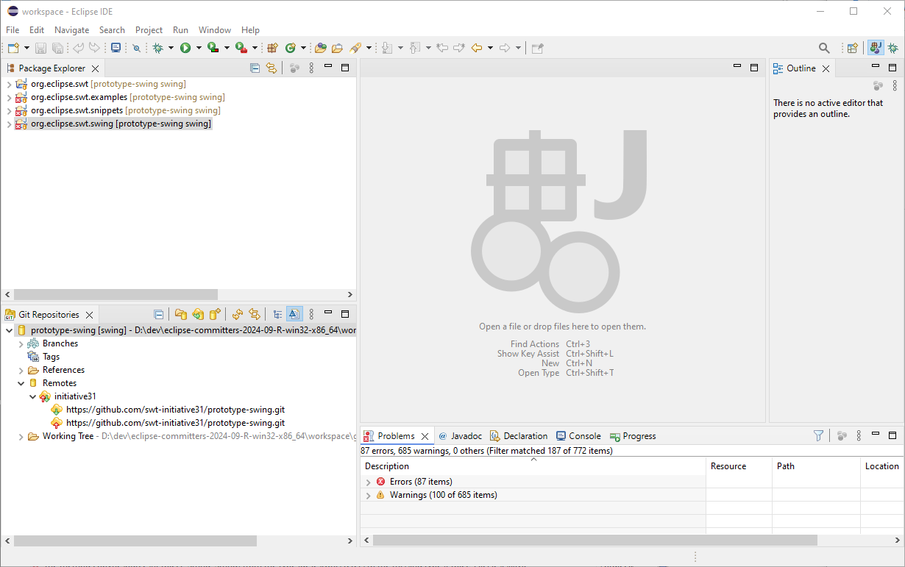

# SWT on Swing

This repository is a fork of the original [SWT repository](https://github.com/eclipse-platform/eclipse.platform.swt) containing prototyping work on exchanging the adaptation of native, basic widgets with Swing widgets.

In the following, you find information about the current state of the prototype and how to try it out. Note that this prototype is currently not further developed.


## Getting Started

To test the prototype, an Eclipse IDE has to be set up and the SWT projects from this repository have to be imported into it to start example applications.

Note that the Swing prototype is currently on tested on Windows and may not work on MacOS and Linux.

### Setup

The easiest way to try this port is to import only the most basic plugins that you need into a clean workspace. In order to do that:

1. Set up a recent Eclipse IDE for Committers (currently 2024-09 or newer including nightly builds), e.g.:
   - [Eclipse IDE for Committers 2024-09](https://www.eclipse.org/downloads/packages/release/2024-09/r/eclipse-ide-eclipse-committers)
2. Clone this repository and switch to the branch named `swing`
3. Start the downloaded IDE and import the following projects:
   - The SWT bundle `org.eclipse.swt`
   - The Swing fragment `org.eclipse.swt.swing`
   - _Optional:_ For testing purposes `org.eclipse.swt.examples` and/or `org.eclipse.swt.snippets`
4. Make sure that there are no plugins that are specific to your environment in the _Target Platform_ (_e.g._ on Windows,  disable every plugin/fragment that contains **win32** in its name):
   - Go to _Window > Preferences_ and open _Plug-in Development > Target Platform_
   - Double click the active target platform and open the _Content_ tab 
   - Filter out the platform-specific plugins and fragments and disable all of them.

The resulting workspace should look something like this:



### Examples

Starting with this, you can try out the SWT implementation with whatever application you want by also importing the according plug-ins into your workspace. The best starting point is the SWT `ControlExample`, a demo application containing all basic SWT widgets with configurability for most of their functionality, to see how the widgets look like and behave. It is also possible to start an Eclipse application based on Swing (see screenshots in [the documentataion](https://github.com/swt-initiative31/documents/blob/main/results/swing.md)), but this is currently complicated to set up.

#### `ControlExample`

The `ControlExample` is part of the example project. It is placed in `org.eclipse.swt.examples.controlexample`. You can run this class as a Java application. Everything you see in this application is rendered with SWT using only Swing.

#### `SnippetExplorer`

This one is an explorer that lets you discover each and every available snippet inside `org.eclipse.swt.snippets`, search through them, see their source code and (sometimes) even see a screenshot of them.

#### `GraphicsExample`

This snippet showcases some interesting features for graphics like **anti-aliasing** and more. Some other capabilities showcased here are still not functional though.

### Theming

You can apply any Swing theme of your choice and it will be applied to the application. All you have to do is add the _VM-argument_ `-Dswt.swing.laf` to the run configuration, _e.g._:

```java
-Dswt.swing.laf=com.sun.java.swing.plaf.motif.MotifLookAndFeel
```

More sophisticated third-party themes can also be used by just placing the JAR of that theme on the classpath and selecting the proper theme _e.g._ [FlatLaf's **Darcula**](https://www.formdev.com/flatlaf/themes/) theme:

```java
-Dswt.swing.laf=com.formdev.flatlaf.FlatDarculaLaf
```


## State

Note that this is work-in-progress prototyping work. The implementation is not (supposed to be) production ready. There are compile errors and it is, in particular, not easy to start an Eclipse application yet. Still, in the `ControlExample` you can experience every basic widget working.
